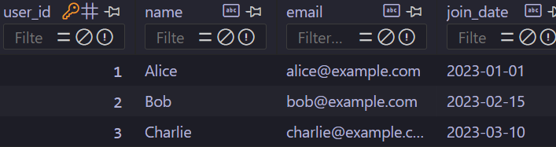
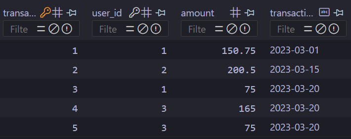

## Python SQLite Dash Application

#### Overview

This project is a Python application that interacts with a local SQLite database, performs data queries, processes the retrieved data, and visualizes the results using a Dash web application. The application allows users to view transaction data and generate reports on user spending.

#### Features

* SQLite Database: Contains users and transactions tables.
* Data Queries: Includes functionalities to fetch user data, calculate spending, and identify top spenders.
* Data Visualization: Utilizes Dash to create interactive visualizations, including bar charts for user spending.
* Responsive Dashboard: Provides a web-based dashboard to view and analyze transaction data.

#### Prerequisites

* Python 3.x: Ensure you have Python 3 installed.
* Pip: Package installer for Python.

#### Setup Instructions

##### 1. Clone the Repository

    git clone https://github.com/rkgupta7463/python-developer-intern.git

    cd python-developer-intern

##### 2. Create a Virtual Environment
Create a virtual environment to isolate the project dependencies:

    python -m venv env

#### Activate the virtual environment:

* On macOS/Linux:

        source env/bin/activate
* On Windows:
        env\Scripts\activate

### 3. Install Dependencies
Install the required Python packages:

    pip install -r requirements.txt

### 4. Initialize the Database
Run the following script to create the SQLite database (`python_intern.db`) and populate it with sample data:
    
    python initialize_db.py

### 5. Run the Dash Application

Start the Dash application:
    
    python app.py

### 6. Access the Application

Open your web browser and navigate to:

    http://127.0.0.1:8050

You should see the Dash application running, displaying various visualizations and data tables.

### Project Structure

* initialize_db.py: Script to set up the SQLite database and insert sample data.
* data_processing.py: Contains functions to query and process data from the SQLite database.
* app.py: Main Dash application script that sets up the web interface and visualizations.
* requirements.txt: Lists the Python packages required to run the application.
* README.md: Provides instructions for setting up and running the project.

### Sample Data

The project comes with a pre-populated SQLite database (`python_intern.db`) containing sample users and transaction data. This data is used to demonstrate the application's capabilities.

#### Users Table

#### Transactions Table

### Contributing

Contributions are welcome! If you find any issues or have suggestions for improvements, please open an issue or submit a pull request.

### Contact

If you have any questions or need further assistance, feel free to contact the project maintainer.